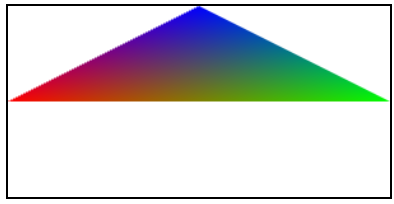
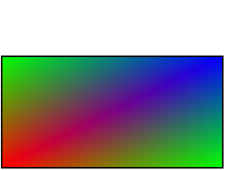
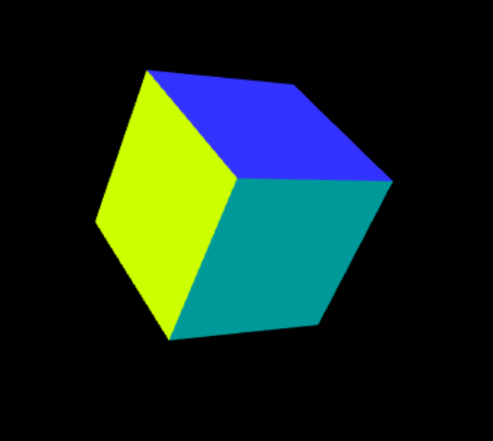

# 3D-Game-Shaders-CG-Lecture

## Basic WebGL Exercises

- [[1]Triangle 2D](Basic%20WebGL%20Exercises%2F%5B1%5DTriangle%202D)

\

- [[2]Cube 3D](Basic%20WebGL%20Exercises%2F%5B2%5DCube%203D)

- [[3]Camera transformation 3D](Basic%20WebGL%20Exercises%2F%5B3%5DCamera%20transformation%203D)

<video src="vid/camTransform.gif" width="270" height="250"/>
